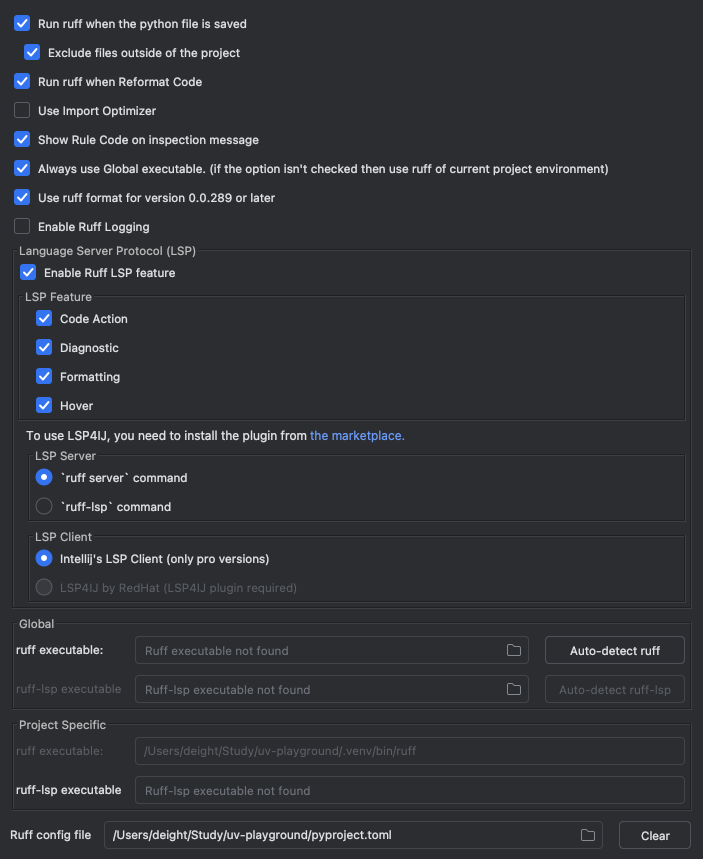

# uv-playground

- uv + Ruff 테스트
    - uv, Ruff, pre-commit, GitHub Actions 조합을 학습하고 테스트하기 위한 예제 프로젝트입니다.
    - 특히, `uv`를 사용하여 패키지 관리 및 가상 환경을 통합하고, `Ruff`를 통해 코드 품질 관리를 자동화하는 데 중점을 둡니다.

# 주요 특징

* uv: Astral에서 개발한 초고속 Python 패키지 설치 및 가상 환경 관리 도구
* Ruff: Rust로 작성된 매우 빠른 Python 린터 및 포맷터

## 프로젝트 구조

```markdown
.
├── .github/workflows/ # GitHub Actions 워크플로우
│ └── ci.yaml
├── .venv/ # uv 가상 환경 (git 무시됨)
├── app/ # FastAPI 애플리케이션 소스 코드
│ ├── __init__.py
│ └── main.py # FastAPI 앱 및 라우터 정의
├── tests/ # 테스트 코드
│ ├── __init__.py
│ └── test_main.py # main.py 테스트
├── .gitignore # Git 무시 파일 목록
├── .pre-commit-config.yaml # pre-commit 훅 설정
├── .python-version # python 버전
├── pyproject.toml # 프로젝트 메타데이터, 의존성, Ruff 설정
└── README.md # 현재 파일
```

## 기술 스택

* Python 3.9+
* FastAPI
* Uvicorn (ASGI 서버)
* uv (패키지 및 환경 관리)
* Ruff (린터 & 포맷터)
* Pytest (테스트 프레임워크)
* HTTPX (비동기 HTTP 클라이언트 for 테스트)
* pre-commit (Git 훅 관리)
* GitHub Actions (CI)

## 시작하기

### 1. 사전 요구 사항

* **Python:** 3.12 버전 이상 설치
* **uv:** `uv` 설치 (아직 설치하지 않았다면)
    ```bash
    # macOS / Linux
    curl -LsSf [https://astral.sh/uv/install.sh](https://astral.sh/uv/install.sh) | sh
    ```

### 2. 설치 및 설정

1. **레포지토리 클론:**
   ```bash
   git clone [https://github.com/deight93/uv-playground.git](https://github.com/deight93/uv-playground.git)
   cd uv-playground
   ```

2. **가상 환경 생성 및 활성화:**
   ```bash
   # .venv 이름으로 가상 환경 생성
   uv venv .venv

   # 가상 환경 활성화 (macOS / Linux)
   source .venv/bin/activate
   ```

3. **의존성 설치:**
   `uv`를 사용하여 `pyproject.toml`에 정의된 모든 의존성(개발 의존성 포함)을 설치합니다.
   ```bash
   uv pip install -e .[dev]
   uv sync
   ```
    * `-e` 플래그는 현재 프로젝트를 편집 가능 모드(editable mode)로 설치합니다.
    * `.[dev]`는 기본 의존성과 `[project.optional-dependencies.dev]` 그룹의 의존성을 모두 설치합니다.

4. **pre-commit 훅 설치:**
   Git 커밋 시 자동으로 코드 품질 검사를 실행하도록 설정합니다.
   ```bash
   uv run pre-commit install
   ```

## 개발

### 애플리케이션 실행

`uvicorn`을 사용하여 로컬에서 FastAPI 애플리케이션을 실행합니다. `--reload` 옵션은 코드 변경 시 자동으로 서버를 재시작합니다.

```bash
uv run uvicorn app.main:app --host 0.0.0.0 --port 8000 --reload
```

이제 브라우저나 API 클라이언트에서 `http://localhost:8000/healthcheck` 로 접속하여 응답을 확인할 수 있습니다.

### 테스트 실행

`pytest`를 사용하여 모든 테스트를 실행합니다.

```bash
uv run pytest
```

### 코드 품질 관리 (Ruff & pre-commit)

* **포맷팅:** 코드를 `Ruff`의 포맷 규칙에 맞게 자동으로 수정합니다.
    ```bash
    uv run ruff format .
    ```
* **린팅:** 코드를 분석하여 잠재적인 오류나 스타일 문제를 찾아냅니다. `--fix` 옵션으로 자동 수정 가능한 문제를 해결할 수 있습니다.
    ```bash
    uv run ruff check . --fix
    ```
* **pre-commit:** `git commit` 실행 시 `.pre-commit-config.yaml`에 설정된 `Ruff` (포맷팅 및 린팅) 훅이 자동으로 실행되어 코드 품질을 강제합니다. 변경 사항이
  있으면 커밋이 중단되고, 수정된 파일을 다시 스테이징한 후 커밋해야 합니다.

## IntelliJ IDEA / PyCharm Ruff 설정

IntelliJ IDEA 또는 PyCharm에서 `Ruff`를 통합하여 개발 중 실시간 피드백과 자동 포맷팅 기능을 활용할 수 있습니다.

1. **Ruff 플러그인 설치:**
    * `Settings/Preferences` > `Plugins` 로 이동합니다.
    * `Marketplace` 탭에서 "Ruff"를 검색하여 설치합니다.
    * IDE를 재시작합니다.

2. **Ruff 설정 활성화:**
    * `Settings/Preferences` > `Tools` > `Ruff` 로 이동합니다.
    * **"Enable Ruff formatter"** 체크박스를 선택합니다. (파일 저장 시 자동 포맷팅)
    * **"Use ruff format"** 체크박스를 선택합니다.
    * **(선택 사항)** "Run ruff lint" 아래의 **"Enable Ruff linter (requires IDE restart)"** 를 체크하면 실시간 린트 검사 결과를 에디터에
      표시해줍니다. (IDE 재시작 필요)
      

3. **확인:**
    * Python 파일을 열고 코드를 수정한 뒤 저장(Ctrl+S / Cmd+S)하면 `Ruff` 포맷터가 자동으로 적용되어야 합니다.
    * 린트 규칙 위반 시 에디터에 밑줄 등으로 표시되어야 합니다 (린터 활성화 시).
    * 플러그인은 일반적으로 프로젝트의 가상 환경(`.venv`) 내에 설치된 `ruff` 실행 파일을 자동으로 감지하여 사용합니다. `pyproject.toml`의 설정을 읽어 적용합니다.

## CI (Continuous Integration)

이 프로젝트는 GitHub Actions를 사용하여 CI 파이프라인을 구축했습니다. (`.github/workflows/ci.yaml`)

* **트리거:** `main` 브랜치에 `push` 되거나 `pull_request`가 생성/업데이트될 때 실행됩니다.
* **작업:**
    1. 코드를 체크아웃합니다.
    2. `uv`를 설치합니다.
    3. 다양한 Python 버전 (3.9, 3.10, 3.11) 환경을 설정하고 `uv` 캐싱을 활성화합니다.
    4. `uv`를 사용하여 프로젝트 의존성을 설치합니다.
    5. `Ruff`를 사용하여 코드 린트 검사를 실행합니다 (`ruff check .`).
    6. `Ruff`를 사용하여 코드 포맷팅 검사를 실행합니다 (`ruff format --check .`).
    7. `pytest`를 사용하여 모든 테스트를 실행합니다.

CI 파이프라인의 상태는 이 README 상단의 배지를 통해 확인할 수 있습니다.
